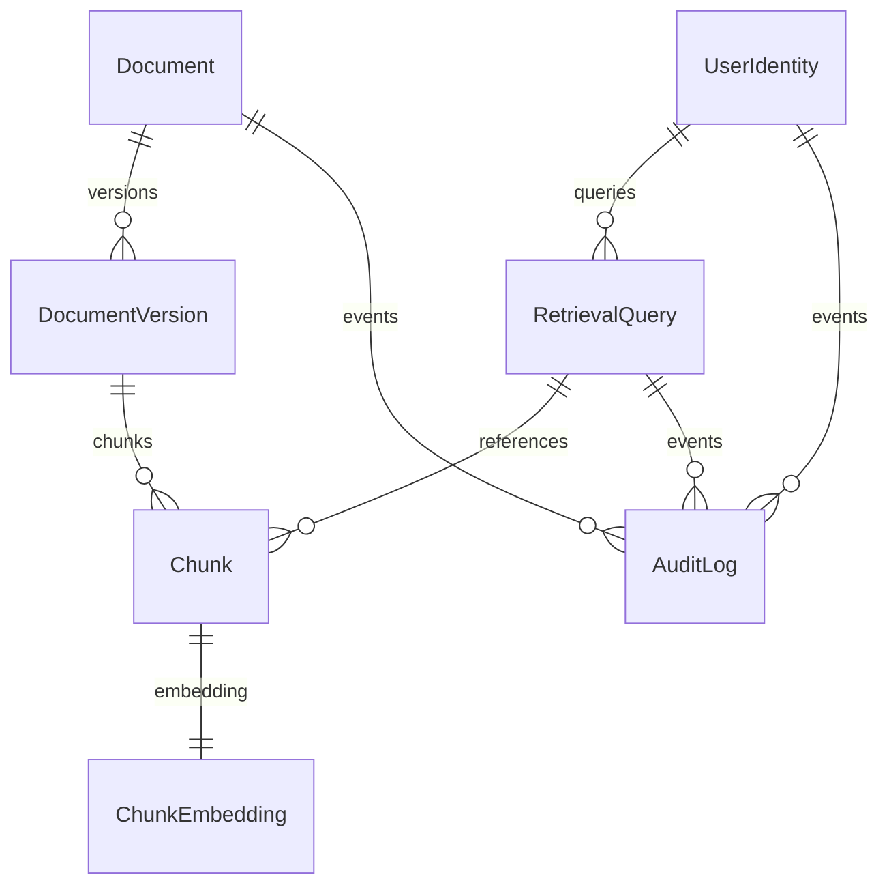

# Data Model – BMS Agent MVP

## Document
- **Fields**: `document_id` (UUID), `filename`, `source_path`, `content_type`, `ingested_at`, `checksum`, `size_bytes`, `version`
- **Constraints**: `content_type` must be in {pdf, docx, pptx, csv, xlsx, txt}; `size_bytes` ≤ 1 GB; `version` increments per upload.
- **Relationships**: One-to-many with `DocumentVersion`; one-to-many with `AuditLog`.

## DocumentVersion
- **Fields**: `version_id` (UUID), `document_id`, `version_number`, `status` (ingested|processing|indexed|failed), `created_at`, `processed_at`, `notes`
- **Constraints**: `version_number` sequential per `document_id`; `status` transitions follow ingestion pipeline.

## Chunk
- **Fields**: `chunk_id` (UUID), `version_id`, `chunk_index`, `text`, `token_count`, `hierarchy` (parent|child), `created_at`
- **Constraints**: `token_count` ≤ 1500; `chunk_index` contiguous and zero-based.
- **Relationships**: One-to-one with `ChunkEmbedding`; many-to-one to `DocumentVersion`.

## ChunkEmbedding
- **Fields**: `chunk_id`, `chunk_embedding` (1024-d), `parent_embedding` (1024-d), `child_embedding` (1024-d), `full_doc_embedding` (1024-d), `keyword_sparse` (sparse vector), `metadata` (JSON), `embedding_model`, `embedding_version`, `created_at`
- **Enhanced Fields**: `contextual_description`, `surrounding_context`, `quality_score`, `faithfulness`, `relevancy`, `precision`, `recall`, `has_context`, `context_type`, `late_chunking_applied`, `processing_version`, `technical_terms`, `entity_types`
- **Constraints**: `embedding_model` = `snowflake-arctic-embed2` (1024-d); all enhanced processor v4.0 features stored.
- **Relationships**: One-to-one with `Chunk`; stored in Qdrant `nomad_bms_documents` collection with complete feature coverage.

## RetrievalQuery
- **Fields**: `query_id` (UUID), `user_id`, `query_text`, `filter_params` (JSON), `created_at`, `response_time_ms`, `result_ids` (array of `chunk_id`), `relevance_scores` (array<float>)
- **Constraints**: `response_time_ms` must be logged for latency reporting; `result_ids` limited to top 10.
- **Relationships**: Many-to-one with `UserIdentity`; referenced in audit logging.

## AuditLog
- **Fields**: `log_id` (UUID), `event_type` (ingest|search|admin|auth), `subject_id`, `actor`, `metadata` (JSON), `timestamp`
- **Constraints**: Retain ≥90 days; immutable entries.
- **Relationships**: Optionally links to `Document`, `RetrievalQuery`, or `UserIdentity` depending on event.

## UserIdentity
- **Fields**: `user_id` (UUID), `role` (admin|operator|service), `external_ref`, `created_at`, `last_seen_at`
- **Constraints**: `role` drives RBAC checks in `api/security.py`.
- **Relationships**: One-to-many with `RetrievalQuery` and `AuditLog`.

## Operational Metrics (aggregated views)
- **Views**: `metrics_latency`, `metrics_ingestion`, `metrics_errors`
- **Fields**: `window_start`, `window_end`, `metric_name`, `value`, `p95`, `p99`
- **Purpose**: Feed `/metrics/uplink` endpoint and manual alert runbooks.

## Diagram

