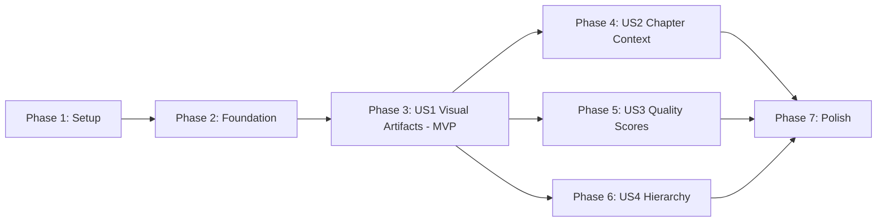

# Implementation Tasks: Search Tool Enhanced Retrieval

**Feature Branch**: `003-search-tool-refactor`
**Date**: 2025-10-22
**Spec**: [spec.md](./spec.md) | **Plan**: [plan.md](./plan.md)

## Overview

This document defines the implementation tasks for enhancing the BMS search tool (`bms_search.py`) to display visual artifacts, chapter hierarchy, quality scores, and hierarchical chunk relationships. Tasks are organized by user story to enable independent implementation and delivery.

**Implementation Strategy**: MVP-first, incremental delivery
- **MVP**: User Story 1 (Visual Artifacts) - Delivers immediate value
- **Increments**: Add US2, US3, US4 independently after MVP validation

---

## Phase 1: Setup & Environment

**Goal**: Prepare development environment and verify prerequisites

- [ ] T001 Verify Python 3.11+ installed and accessible
- [ ] T002 Verify /workspace/visual-artifacts/ directory exists and contains artifacts
- [ ] T003 Verify Qdrant running at localhost:6333 with nomad_bms_documents collection
- [ ] T004 Verify bms_search.py exists at /workspace/bms-agent/bms_search.py
- [ ] T005 Create feature branch 003-search-tool-refactor if not already created
- [ ] T006 Create tests directory at /workspace/bms-agent/tests/ if not exists
- [ ] T007 Verify test data: Run Qdrant query to confirm enhanced metadata exists (has_visual_artifacts, chapter_path, quality_score)

**Validation**: All prerequisites met, feature branch active, test data verified

---

## Phase 2: Foundational Infrastructure

**Goal**: Add shared infrastructure needed by all user stories

### Result Caching Infrastructure

- [ ] T008 Add _result_cache instance variable to Tools.__init__() in bms_search.py
- [ ] T009 [P] Implement _update_result_cache() method in bms_search.py (stores results by chunk_id with LRU limit of 100)
- [ ] T010 [P] Implement _check_hierarchy_cache() method in bms_search.py (checks parent_chunk_id availability, returns tuple)

### Core Enrichment Method

- [ ] T011 Implement _enrich_search_results() method skeleton in bms_search.py (accepts results list, returns enriched list)
- [ ] T012 Add result cache update to search_smart() method after boosting (call _update_result_cache())
- [ ] T013 Add result cache update to search_semantic() method after query (call _update_result_cache())
- [ ] T014 Add result cache update to search_hybrid() method after RRF (call _update_result_cache())

**Validation**: Result caching infrastructure in place, all search methods updated

**Dependencies**: None (blocking foundation for all stories)

---

## Phase 3: User Story 1 - Visual Artifacts Display (P1) 🎯 MVP

**Story Goal**: Display images, diagrams, and slides inline with search results

**Independent Test**: Search for "BMS-BDEV-FOR-013" or "safety card", verify visual artifacts appear inline with captions

### Artifact Loading Optimization

- [ ] T015 [US1] Replace existing _load_visual_artifacts() with _load_visual_artifacts_optimized() in bms_search.py (lines 998-1066)
- [ ] T016 [US1] Implement direct path construction using document_id in _load_visual_artifacts_optimized()
- [ ] T017 [US1] Add artifact type detection (img_ vs slide_) in _load_visual_artifacts_optimized()
- [ ] T018 [US1] Add base64 encoding for PNG files in _load_visual_artifacts_optimized()
- [ ] T019 [US1] Add caption handling with fallback in _load_visual_artifacts_optimized()
- [ ] T020 [US1] Add graceful error handling for missing artifacts in _load_visual_artifacts_optimized()

### Enrichment Integration

- [ ] T021 [US1] Add visual artifacts enrichment to _enrich_search_results() (check has_visual_artifacts, call _load_visual_artifacts_optimized)
- [ ] T022 [US1] Update search_smart() to call _enrich_search_results() before dashboard generation
- [ ] T023 [US1] Update search_semantic() to call _enrich_search_results() before dashboard generation
- [ ] T024 [US1] Update search_hybrid() to call _enrich_search_results() before dashboard generation

### Dashboard Updates

- [ ] T025 [US1] Update _generate_search_dashboard() to render visual artifacts section (check result['visual_artifacts'])
- [ ] T026 [US1] Add artifacts gallery HTML generation in _generate_search_dashboard() (grid layout, captions)
- [ ] T027 [US1] Add artifact badge to card header showing count in _generate_search_dashboard() (e.g., "🖼️ 3")
- [ ] T028 [US1] Add CSS styling for artifacts gallery in _generate_search_dashboard() (responsive grid, hover effects)

### Testing & Validation

- [ ] T029 [US1] Manual test: Search for "safety card", verify artifacts display
- [ ] T030 [US1] Manual test: Search for "BMS-BDEV-FOR-013", verify slide images display
- [ ] T031 [US1] Manual test: Verify dashboard renders within 2 seconds for 5 results with artifacts
- [ ] T032 [US1] Manual test: Click artifact image, verify opens in new tab
- [ ] T033 [US1] Manual test: Search for document without artifacts, verify graceful degradation (no artifacts section)

**Acceptance Criteria**:
- ✅ Visual artifacts display inline with search results
- ✅ Captions appear beneath each artifact
- ✅ Up to 3 artifacts shown per result card
- ✅ Dashboard loads within 2 seconds (SC-001)
- ✅ Graceful handling of missing artifacts

**MVP Delivery**: Deploy User Story 1 to OpenWebUI after validation

---

## Phase 4: User Story 2 - Chapter-Aware Result Grouping (P2)

**Story Goal**: Display chapter hierarchy breadcrumbs for contextual navigation

**Independent Test**: Search for "test completion", verify chapter paths display (e.g., "Chapter 2 > Section 2.3")

### Chapter Formatting

- [ ] T034 [P] [US2] Implement _format_chapter_context() method in bms_search.py (extract chapter metadata, format breadcrumb)
- [ ] T035 [P] [US2] Add chapter number prefix logic in _format_chapter_context() ("Chapter X >" if chapter_number exists)
- [ ] T036 [P] [US2] Generate breadcrumb HTML with icon in _format_chapter_context() (📂 icon + path)
- [ ] T037 [P] [US2] Add indentation based on chapter_level in _format_chapter_context()

### Enrichment Integration

- [ ] T038 [US2] Add chapter context enrichment to _enrich_search_results() (check chapter_path, call _format_chapter_context)
- [ ] T039 [US2] Update _generate_search_dashboard() to render chapter breadcrumb (insert above card content)
- [ ] T040 [US2] Add CSS styling for chapter breadcrumb in _generate_search_dashboard() (subtle background, proper spacing)

### Testing & Validation

- [ ] T041 [US2] Manual test: Search for "test completion", verify chapter paths display
- [ ] T042 [US2] Manual test: Verify hierarchical chapters show proper nesting (Chapter > Sub-chapter)
- [ ] T043 [US2] Manual test: Search for document without chapters, verify graceful degradation (no breadcrumb)
- [ ] T044 [US2] Verify 90% of results with chapter metadata display breadcrumbs (SC-002)

**Acceptance Criteria**:
- ✅ Chapter path displays in breadcrumb format
- ✅ Hierarchical structure shows proper nesting
- ✅ Graceful degradation when chapter metadata missing
- ✅ 90% display rate for results with metadata (SC-002)

---

## Phase 5: User Story 3 - Quality Score Transparency (P3)

**Story Goal**: Display quality validation scores with color-coded badges

**Independent Test**: Search for any document, verify quality badges appear (if quality validation enabled)

### Quality Formatting

- [ ] T045 [P] [US3] Implement _format_quality_breakdown() method in bms_search.py (extract quality scores, format badge)
- [ ] T046 [P] [US3] Add color mapping logic in _format_quality_breakdown() (green ≥80%, yellow ≥60%, red <60%)
- [ ] T047 [P] [US3] Generate badge HTML in _format_quality_breakdown() (colored span with percentage)
- [ ] T048 [P] [US3] Generate tooltip HTML in _format_quality_breakdown() (component breakdown: faithfulness, relevancy, precision, recall)

### Enrichment Integration

- [ ] T049 [US3] Add quality score enrichment to _enrich_search_results() (check quality_score > 0, call _format_quality_breakdown)
- [ ] T050 [US3] Update _generate_search_dashboard() to render quality badge in card header
- [ ] T051 [US3] Add tooltip hover behavior in _generate_search_dashboard() (CSS :hover or JS)
- [ ] T052 [US3] Add CSS styling for quality badge in _generate_search_dashboard() (color-coded backgrounds)

### Testing & Validation

- [ ] T053 [US3] Manual test: If quality validation enabled, verify badges display with correct colors
- [ ] T054 [US3] Manual test: Hover over badge, verify tooltip shows component breakdown
- [ ] T055 [US3] Manual test: Verify quality score = 0.0 results show no badge (graceful degradation)
- [ ] T056 [US3] Verify 100% of results with quality metadata display badges (SC-005)

**Acceptance Criteria**:
- ✅ Quality badges display with correct color coding
- ✅ Hover tooltip shows component scores
- ✅ Graceful degradation when quality_score = 0.0
- ✅ 100% display rate for scored results (SC-005)

**Note**: Quality validation may be disabled in production (all scores = 0.0). Feature gracefully degrades.

---

## Phase 6: User Story 4 - Hierarchical Context Retrieval (P4)

**Story Goal**: Provide expand/collapse buttons to navigate parent/child chunks

**Independent Test**: Search for specific detail, click "Expand Context", verify parent chunk displays

### Hierarchy UI Controls

- [ ] T057 [P] [US4] Add hierarchy flag enrichment to _enrich_search_results() (set has_parent, has_children, parent_in_cache, children_in_cache)
- [ ] T058 [P] [US4] Update _generate_search_dashboard() to add "Expand Context" button when has_parent = True
- [ ] T059 [P] [US4] Update _generate_search_dashboard() to add "Show Details" button when has_children = True
- [ ] T060 [P] [US4] Add JavaScript handler for expand button clicks in _generate_search_dashboard()

### Context Expansion Logic

- [ ] T061 [US4] Implement parent chunk lookup in JavaScript (check _result_cache for parent_chunk_id)
- [ ] T062 [US4] Display parent chunk content when found in cache (expand card with parent text)
- [ ] T063 [US4] Display "Parent not available" message when not in cache (with suggestion to search parent_title)
- [ ] T064 [US4] Add visual indentation for parent/child hierarchy in expanded view
- [ ] T065 [US4] Add CSS styling for expanded context section (subtle background, proper spacing)

### Testing & Validation

- [ ] T066 [US4] Manual test: Search, click "Expand Context", verify parent displays (if in cache)
- [ ] T067 [US4] Manual test: Verify "Parent not available" message when parent not in results
- [ ] T068 [US4] Manual test: Verify expansion completes within 300ms (SC-004)
- [ ] T069 [US4] Manual test: Verify visual hierarchy indicators display correctly

**Acceptance Criteria**:
- ✅ Expand buttons appear when parent/child exist
- ✅ Parent context displays when available in cache
- ✅ Graceful message when parent not available
- ✅ Expansion completes within 300ms (SC-004)

**Note**: Child retrieval not implemented (no child_ids in Qdrant schema). Only parent expansion supported.

---

## Phase 7: Polish & Cross-Cutting Concerns

**Goal**: Finalize implementation with error handling, performance optimization, and documentation

### Error Handling & Edge Cases

- [ ] T070 [P] Add logging for artifact loading failures in _load_visual_artifacts_optimized() (warn when file not found)
- [ ] T071 [P] Add file size validation in _load_visual_artifacts_optimized() (skip if >5MB)
- [ ] T072 [P] Add deduplication logic in _enrich_search_results() (skip duplicate parent/child pairs)
- [ ] T073 [P] Add graceful fallback for corrupted artifacts in _load_visual_artifacts_optimized()

### Performance Optimization

- [ ] T074 [P] Verify artifact loading uses O(m) direct path construction (no directory scanning)
- [ ] T075 [P] Add performance logging in search methods (measure enrichment time)
- [ ] T076 Test dashboard rendering with 10 results, verify ≤2 seconds (SC-003 within 500ms budget)
- [ ] T077 Test dashboard rendering with 20 results, measure time (expected 3-4s, exceeds budget)

### Valve Configuration

- [ ] T078 [P] Add ENABLE_VISUAL_ARTIFACTS valve setting to class Valves in bms_search.py
- [ ] T079 [P] Add MAX_ARTIFACTS_PER_RESULT valve setting to class Valves in bms_search.py (default: 3)
- [ ] T080 [P] Add ENABLE_CHAPTER_CONTEXT valve setting to class Valves in bms_search.py
- [ ] T081 [P] Add ENABLE_QUALITY_BADGES valve setting to class Valves in bms_search.py
- [ ] T082 Update enrichment methods to respect valve settings (check before enriching)

### Documentation

- [ ] T083 Update docstrings for all new methods in bms_search.py (follow PEP 257 style)
- [ ] T084 Update TOOL_USAGE_INSTRUCTIONS.md with new features (visual artifacts, chapter context, quality scores)
- [ ] T085 Update BMS_SEARCH_V4.2_COMPLETE_UPGRADE_PACKAGE.md with enhancement details
- [ ] T086 Add inline code comments for complex logic (artifact path construction, hierarchy checks)

### Final Validation

- [ ] T087 Run syntax check: python3 -m py_compile bms_search.py
- [ ] T088 Verify imports: python3 -c "from bms_search import Tools; t = Tools()"
- [ ] T089 Run full regression test suite (all user stories)
- [ ] T090 Verify backward compatibility (searches without enhanced metadata work unchanged)
- [ ] T091 Measure dashboard load time for 5 results with artifacts, verify ≤2s (SC-001)
- [ ] T092 Deploy to OpenWebUI and test in production environment

**Final Acceptance**: All user stories validated, performance targets met, backward compatibility confirmed

---

## Task Dependencies

### Story Completion Order

**Critical Path**:
1. Setup → Foundation → US1 (MVP) → Deploy & Validate
2. After MVP validation: US2, US3, US4 can be implemented independently
3. Polish phase applies to all completed stories

### Inter-Story Dependencies

- **US1 (Visual Artifacts)**: No dependencies, can be implemented first ✅
- **US2 (Chapter Context)**: Independent of US1, requires Foundation only ✅
- **US3 (Quality Scores)**: Independent of US1, requires Foundation only ✅
- **US4 (Hierarchy)**: Independent of US1-US3, requires Foundation only ✅

**Parallel Opportunities**: US2, US3, US4 can be implemented in parallel after US1 MVP

---

## Parallel Execution Examples

### Phase 2: Foundational Infrastructure

**Parallel Track A**:
- T009: Implement _update_result_cache()
- T010: Implement _check_hierarchy_cache()

**Parallel Track B**:
- T011: Implement _enrich_search_results() skeleton

**Sequential After Parallel**:
- T012-T014: Update all search methods (depends on T009, T011)

### Phase 3: User Story 1 (MVP)

**Parallel Track A - Artifact Loading**:
- T015-T020: Optimize _load_visual_artifacts_optimized() (6 tasks, single file)

**Parallel Track B - Dashboard**:
- T025-T028: Update _generate_search_dashboard() HTML/CSS (4 tasks, single file)

**Sequential After Parallel**:
- T021-T024: Enrichment integration (depends on T015-T020)
- T029-T033: Testing (depends on all implementation)

### Phase 4-6: Independent Stories

**Fully Parallel After US1 MVP**:
- **Developer 1**: Implement US2 (T034-T044)
- **Developer 2**: Implement US3 (T045-T056)
- **Developer 3**: Implement US4 (T057-T069)

All three stories are independent and can be developed simultaneously.

### Phase 7: Polish

**Parallel Track A - Error Handling**:
- T070-T073: Error handling tasks

**Parallel Track B - Configuration**:
- T078-T082: Valve settings

**Parallel Track C - Documentation**:
- T083-T086: Documentation updates

**Sequential Final**:
- T087-T092: Final validation (depends on all implementation)

---

## MVP Scope & Incremental Delivery

### MVP (Minimum Viable Product)

**Scope**: User Story 1 only (Visual Artifacts Display)

**Rationale**:
- Delivers immediate value (images inline with search results)
- Smallest deployable increment that users can validate
- No dependencies on other stories
- Can be tested independently

**MVP Tasks**: T001-T033 (33 tasks)

**Estimated Time**: 2-3 days for single developer

**Deployment Strategy**:
1. Complete Phase 1 (Setup)
2. Complete Phase 2 (Foundation)
3. Complete Phase 3 (US1)
4. Deploy to OpenWebUI
5. Gather user feedback
6. Proceed with US2-US4 based on feedback

### Post-MVP Increments

**Increment 2**: Add US2 (Chapter Context) - Independent enhancement

**Increment 3**: Add US3 (Quality Scores) - Independent enhancement

**Increment 4**: Add US4 (Hierarchy) - Independent enhancement

**Increment 5**: Polish & optimization (Phase 7)

---

## Task Summary

**Total Tasks**: 92

**By Phase**:
- Phase 1 (Setup): 7 tasks
- Phase 2 (Foundation): 7 tasks
- Phase 3 (US1 - MVP): 19 tasks
- Phase 4 (US2): 11 tasks
- Phase 5 (US3): 12 tasks
- Phase 6 (US4): 13 tasks
- Phase 7 (Polish): 23 tasks

**By Story**:
- Setup & Foundation: 14 tasks
- US1 (Visual Artifacts): 19 tasks
- US2 (Chapter Context): 11 tasks
- US3 (Quality Scores): 12 tasks
- US4 (Hierarchy): 13 tasks
- Polish: 23 tasks

**Parallelizable Tasks**: 47 tasks marked with [P]

**Independent Tests**: 4 user stories, each with specific test criteria

---

## Implementation Notes

### Critical Success Factors

1. **Backward Compatibility**: All enhancements must degrade gracefully when metadata missing
2. **Performance**: Dashboard must render within 2 seconds for 5 results (SC-001)
3. **Single File**: All changes confined to bms_search.py (no backend modifications)
4. **MVP First**: Deploy US1 before proceeding to US2-US4
5. **Independent Stories**: Each user story can be tested and deployed independently

### Technical Constraints

- No modifications to FastAPI backend or Qdrant schema allowed
- Must work with existing OpenWebUI artifact rendering system
- Must access /workspace/visual-artifacts/ directly (no HTTP endpoints)
- Base64 encoding required for inline image display

### Quality Gates

- **Pre-Deployment**: All tasks complete, syntax validated, imports verified
- **Post-MVP**: User validation of visual artifacts feature
- **Post-US2-US4**: Performance validation (SC-001, SC-003, SC-004)
- **Final**: Backward compatibility confirmed, all success criteria met

---

**Version**: 1.0
**Last Updated**: 2025-10-22
**Ready for Implementation**: ✅ Yes
